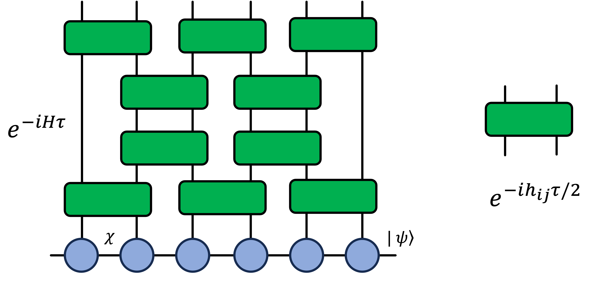

# tensor-network-ahs

This package implements a tensor network based algorithm for simulating Rydberg atom dynamics.
It allows to simulate Analog Hamiltonian Simulation programs for problem sizes of hundreds of atoms, which is unaccessible by statevector simulation methods.
Matrix Product States (MPS) are used to represent the many-body quantum state.

The core of the tensor network simulation is enabled by [iTensor.jl](https://github.com/ITensor/ITensors.jl). The input Analog Hamiltonian Simulation (AHS) program can be constructed using [Braket.jl](https://github.com/amazon-braket/Braket.jl) interface.

## Introduction

We use Time Evolving Block Decimation (TEBD) algorithm to compute state updates for each time step.
After each TEBD step the quantum state is truncated based on the SVD decomposition of the matrix product state. 
The second order Suzuki-Trotter product formula is used for improved simulation accuracy.

A step of TEBD evolution acting on a matrix product state is pictorially shown below.



Computational cost (for each evolution step): $O(χ^3)$, where $χ$ is the current MPS bond dimension.
For the purpose of efficient MPS simulation we perform truncation of the van der Waals terms for distances exceeding a fixed `interation-radius` (supplied as an input argument).
 

## Getting started

0. [Install Julia](https://julialang.org/downloads/) to your machine. To install relevant Julia packages `cd` to the project root and execute
```
julia --project=. -e 'using Pkg; Pkg.instantiate()'
```

### Running MPS-based simulation
1. To run the Braket-AHS program saved as a .json file run:
```
julia mps_runner.jl --program-path=<path_to_ahs.json>
```

In order to generate .json configuration file there are 2 options:

1.A Generate .json using Braket.jl interface provided in `srs/ahs_program.jl`.
```
julia src/ahs_program.jl
```
The output .json file will be saved in `examples/ahs_program.json`.

1.B Generate .json using Python Braket SDK from the AHS program object:
```
ahs_ir = ahs_program.to_ir()
json_object = json.loads(ahs_ir.json())
json_string = json.dumps(json_data, indent=4) 
filename = "ahs_program.json"
with open(filename, "w") as json_file:
    json_file.write(json_string)
```

Example .json config files are provided in `examples/ahs_program*.json`.

#### The required input argument is: 
* `--program-path`: specifies the path to AHS program .json file (example file is provided `./ahs_program.json`)

#### The optional arguments are:
* `--experiment-path`: directory where all experiment results are saved (default is `examples/experiment_braket`). 
* `--interaction-radius`: interaction radius [in meters], only interaction between atoms within the interaction radius are taken into account during MPS simulation (van der Waals tail is truncated for `Rij>interaction_radius` resulting in `Vij=0`). The default value is `interaction-radius=7e-6`.
* `--cutoff`: SVD truncation cutoff parameter for each step of TEBD evolution. The default value is `cutoff=1e-7`.
* `--shots`: number of bitstring samples at final time step. Samples are saved in `<experiment_path>/samples.csv`. Default value is `shots=1000`.
* `--max-bond-dim`: maximum MPS bond dimension throughout TEBD evolution. In case if the bond dimension competes with `cutoff` parameter, the `max-bond-dim` takes priority - the MPS bond dimension can not grow beyond maximum value.
* `--tau`: Trotter time step [in seconds]. Default value is `tau=1e-8` (seconds). 
* `--n-tau-steps`: total number of Trotter steps. The total evolution time is `tau*n-tau-steps`. Default value is `n-tau-steps=400`, corresponds to total evolution time `4 microseconds`.
* `--C6`: Rydberg interaction C6 constant, default value is `C6=5.42e-24` (CI units).
* `--compute-truncation-error`: computes MPS truncation error for each time step and saves truncation error evolution in `<experiment_path>/error_log.txt`. Use with CAUTION, since enabling this option dramatically slows down runtime (requires calculation of exact MPS evolution for each time step).
* `--generate-plots`: generate plots after experiment is finished

### MPS-results

Output files from MPS simulaiton are stored in `<experiment_path>`:
* `ahs_program.json`: copy of the AHS program .json file.
* `atom_coordinates.csv`: Atom coordinates in 2D plane [in meters].
* `mps_density.csv`: evolution of `<n_i>(t)` for each atom as a function of time.
* `mps_samples.csv`: bitstring samples from MPS at `t=T`.
* `correlator_zz.csv`: ZZ correlation function at final time `t=T`: `<Sz_i Sz_j>`.
* `energies.csv`: final energies corresponding to the MPS samples at `t=T`. 
* `summary.txt`: summary file with the experiment information (runtime, input args, etc.)

### Visualization

To run visualization script run:
```
julia plotter.jl <path_to_experiment_results>
```
It will generate plots from the .csv files saved in <path_to_experiment_results>.